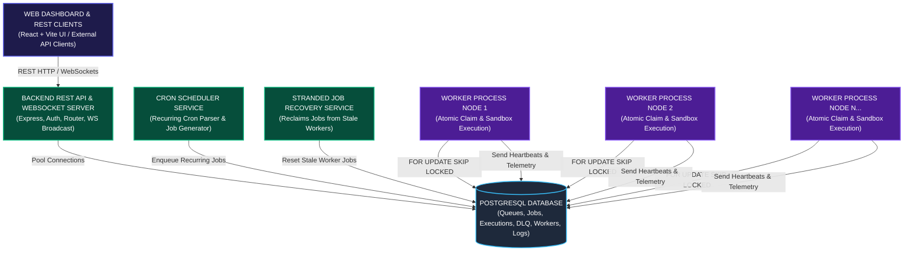
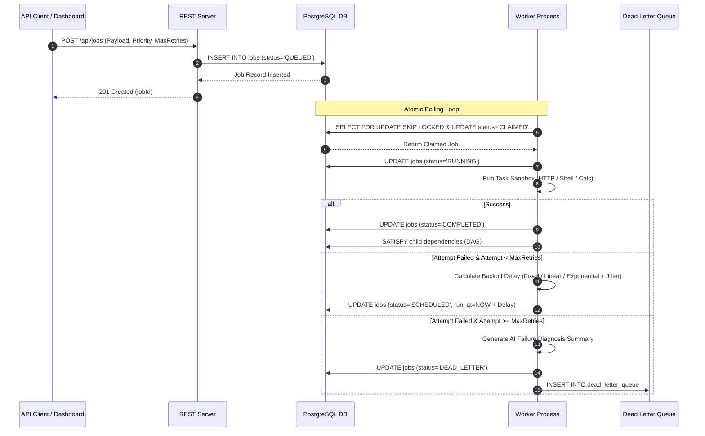

# TaskPulse Architecture & System Topology Documentation

TaskPulse is a production-inspired distributed job scheduling platform designed for reliable asynchronous background processing across a cluster of concurrent worker nodes. It features PostgreSQL atomic queue locking (`FOR UPDATE SKIP LOCKED`), configurable retry strategies, dead-letter queues, real-time WebSocket telemetry, and a web dashboard.

---

## 1. High-Level Component Topology (Box Architecture)

---

## 2. Sequence Diagram: Job Lifecycle & Retry Engine

---

## 3. Subsystem Descriptions

1. **REST API & WebSockets Layer**:
   - Manages Projects, Queues, Jobs, Workers, and Dead-Letter Queue entries.
   - Broadcasts real-time events (`JOB_UPDATED`, `WORKER_HEARTBEAT`, `QUEUE_UPDATED`) over `/ws` to connected web dashboard clients.

2. **PostgreSQL Relational Engine**:
   - Stores all application state with strict foreign keys (`ON DELETE CASCADE`).
   - Indexes `(queue_id, status, run_at, priority DESC, created_at ASC)` to ensure `FOR UPDATE SKIP LOCKED` claims execute in sub-millisecond time.

3. **Worker Engine & Sandboxed Execution**:
   - Independent background worker instances polling queues concurrently.
   - Emits heartbeats every 5 seconds reporting CPU load, Memory usage, and active job task count.
   - Graceful shutdown handler (`SIGINT`/`SIGTERM`) draining active tasks up to 10-second timeout.
