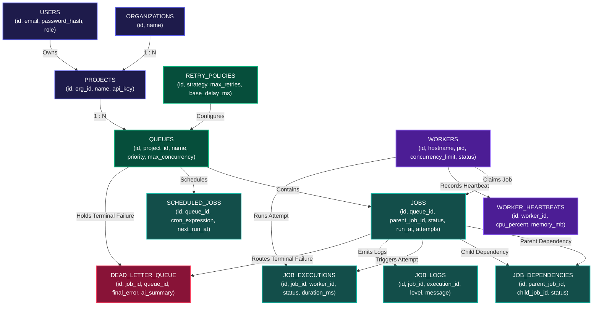

# TaskPulse Entity Relationship (ER) Diagram & Database Schema Specification

This document presents the relational database architecture for **TaskPulse**. The schema is normalized (3NF) and optimized for PostgreSQL with row-level locking (`FOR UPDATE SKIP LOCKED`), foreign key constraints, cascading teardown behavior, and indexed claim queries.

---

## 1. Visual Entity Relationship Map (Box Topology)

---

## 2. Comprehensive Relational Table Specifications

### 2.1 Access Control & Multi-Tenancy

#### `users` Table
Stores system administrators, pipeline operators, and viewers.
- **Primary Key**: `id` (`VARCHAR(64)`)
- **Unique Columns**: `email` (`VARCHAR(255)`)
- **Columns**: `password_hash`, `name`, `role` (`ADMIN`, `OPERATOR`, `VIEWER`), `created_at`

#### `organizations` Table
Root tenant boundary for enterprise teams.
- **Primary Key**: `id` (`VARCHAR(64)`)
- **Columns**: `name`, `created_at`

#### `projects` Table
Projects isolate queues and API keys within an organization.
- **Primary Key**: `id` (`VARCHAR(64)`)
- **Foreign Key**: `org_id` $\rightarrow$ `organizations(id)` (`ON DELETE CASCADE`)
- **Unique Columns**: `api_key` (`VARCHAR(255)`)

---

### 2.2 Queue & Execution Policy Configuration

#### `retry_policies` Table
Defines reusable retry backoff configurations.
- **Primary Key**: `id` (`VARCHAR(64)`)
- **Columns**: `name`, `strategy` (`FIXED`, `LINEAR`, `EXPONENTIAL`), `max_retries`, `base_delay_ms`, `max_delay_ms`, `jitter`

#### `queues` Table
Job queues holding workloads with configurable priority weights and max concurrency.
- **Primary Key**: `id` (`VARCHAR(64)`)
- **Foreign Keys**: 
  - `project_id` $\rightarrow$ `projects(id)` (`ON DELETE CASCADE`)
  - `retry_policy_id` $\rightarrow$ `retry_policies(id)` (`ON DELETE SET NULL`)
- **Unique Constraint**: `(project_id, name)`
- **Columns**: `priority` (1-10), `max_concurrency`, `is_paused` (0 or 1), `created_at`

---

### 2.3 Job Engine & Workload Execution

#### `jobs` Table
Core entity tracking job state across its entire lifecycle (`QUEUED` $\rightarrow$ `CLAIMED` $\rightarrow$ `RUNNING` $\rightarrow$ `COMPLETED` / `FAILED` / `DEAD_LETTER`).
- **Primary Key**: `id` (`VARCHAR(64)`)
- **Foreign Keys**:
  - `queue_id` $\rightarrow$ `queues(id)` (`ON DELETE CASCADE`)
  - `parent_job_id` $\rightarrow$ `jobs(id)` (`ON DELETE SET NULL`)
- **Columns**: `name`, `type` (`HTTP`, `SHELL`, `CALCULATION`, `SIMULATED_FAIL`, `DAG`), `payload` (JSON text), `status`, `priority`, `run_at`, `attempts`, `max_retries`, `retry_strategy`, `base_delay_ms`, `max_delay_ms`, `timeout_ms`, `claimed_by_worker_id`, `claimed_at`, `completed_at`, `failed_at`, `error_message`, `created_at`, `updated_at`

#### `job_dependencies` (DAG Workflows)
Tracks parent-child dependency constraints for directed acyclic graph (DAG) workflow execution.
- **Primary Key**: `id` (`VARCHAR(64)`)
- **Foreign Keys**:
  - `parent_job_id` $\rightarrow$ `jobs(id)` (`ON DELETE CASCADE`)
  - `child_job_id` $\rightarrow$ `jobs(id)` (`ON DELETE CASCADE`)
- **Columns**: `status` (`WAITING`, `SATISFIED`, `FAILED`)

#### `scheduled_jobs` (Cron Engine)
Holds recurring cron schedule rules (`*/5 * * * *`).
- **Primary Key**: `id` (`VARCHAR(64)`)
- **Foreign Key**: `queue_id` $\rightarrow$ `queues(id)` (`ON DELETE CASCADE`)
- **Columns**: `name`, `cron_expression`, `payload`, `job_type`, `is_active`, `last_run_at`, `next_run_at`

---

### 2.4 Worker Cluster & Telemetry

#### `workers` Table
Active worker processes registered in the cluster.
- **Primary Key**: `id` (`VARCHAR(64)`)
- **Columns**: `hostname`, `pid`, `concurrency_limit`, `status` (`ACTIVE`, `DRAINING`, `DEAD`), `registered_at`, `last_heartbeat`

#### `worker_heartbeats` Table
Telemetry logs emitted every 5 seconds per worker node.
- **Primary Key**: `id` (`VARCHAR(64)`)
- **Foreign Key**: `worker_id` $\rightarrow$ `workers(id)` (`ON DELETE CASCADE`)
- **Columns**: `timestamp`, `cpu_percent`, `memory_mb`, `active_jobs_count`

---

### 2.5 Observability & Failure Handling

#### `job_executions` Table
Per-attempt execution audit log detailing duration and worker node assignment.
- **Primary Key**: `id` (`VARCHAR(64)`)
- **Foreign Key**: `job_id` $\rightarrow$ `jobs(id)` (`ON DELETE CASCADE`)
- **Columns**: `worker_id`, `attempt_number`, `status`, `error_message`, `started_at`, `finished_at`, `duration_ms`

#### `job_logs` Table
Console output logs emitted during job execution.
- **Primary Key**: `id` (`VARCHAR(64)`)
- **Foreign Key**: `job_id` $\rightarrow$ `jobs(id)` (`ON DELETE CASCADE`)
- **Columns**: `execution_id`, `level` (`INFO`, `WARN`, `ERROR`), `message`, `timestamp`

#### `dead_letter_queue` (DLQ) Table
Isolates terminal job failures that exceeded maximum retries.
- **Primary Key**: `id` (`VARCHAR(64)`)
- **Foreign Keys**:
  - `job_id` $\rightarrow$ `jobs(id)` (`ON DELETE CASCADE`, `UNIQUE`)
  - `queue_id` $\rightarrow$ `queues(id)` (`ON DELETE CASCADE`)
- **Columns**: `failed_at`, `final_error`, `total_attempts`, `ai_failure_summary`, `status` (`PENDING`, `RETRIED`, `DISCARDED`)

---

## 3. Key Architectural Design Rationale

1. **Why Box-Based Relational Mapping?**
   - The visual box topology map uses distinct color-coded rectangular nodes for Users/Tenant Access (Indigo), Core Config (Emerald), Workload/Job Engine (Teal), Worker Cluster (Purple), and Dead-Letter Queue (Rose).

2. **Atomic Lock-Free Job Claiming (`FOR UPDATE SKIP LOCKED`)**:
   - `CREATE INDEX idx_jobs_claim ON jobs(queue_id, status, run_at, priority DESC, created_at ASC);`
   - Allows PostgreSQL to execute instant row-level locks without blocking concurrent worker nodes.

3. **Cascading Behavior (`ON DELETE CASCADE`)**:
   - Deleting a project or queue automatically cleans up orphaned jobs, execution metrics, logs, and DLQ entries.
